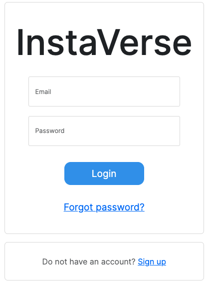
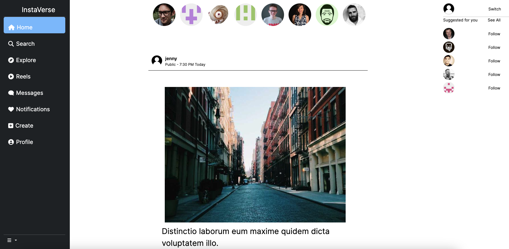
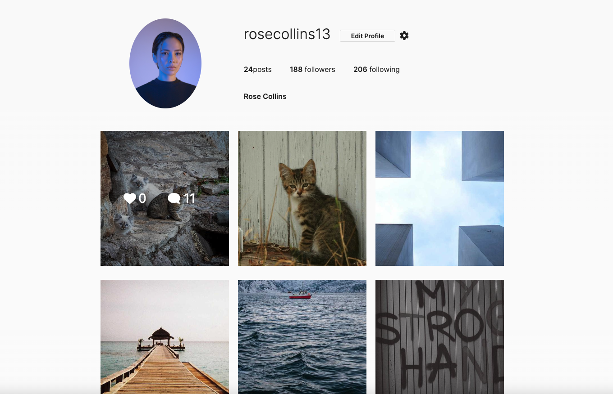
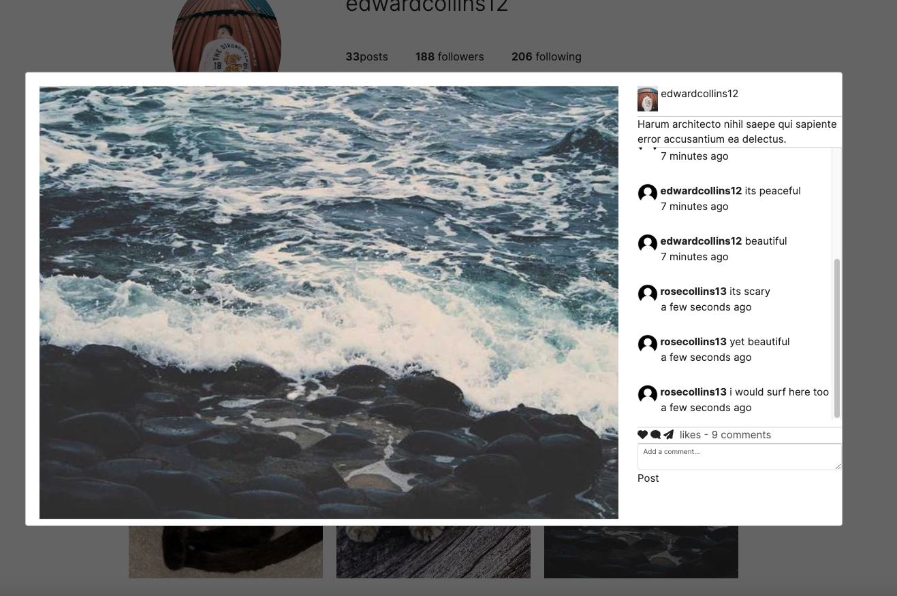
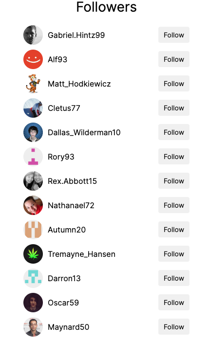

<!-- PROJECT LOGO -->
<br />
<p align="center">
  <a href="https://github.com/kacyphan7/instaVerse-react">
    
  </a>
<h2 align="center">InstaVerse (React)</h2>

<!-- TABLE OF CONTENTS -->
# **About InstaVerse App**

InstaVerse is a photo social media application. The app allows users to view other users photos, upload/share their own photos. InstaVerse also allows users to view other users profile, like and comment on posts.

<details open="open">
  <summary>Table of Contents</summary>
  <ol>
    <li>
      <a href="#about-the-project">About The Project</a>
      <ul>
        <li><a href="#built-with">Built With</a></li>
        <li><a href="#built-with">Features of InstaVerse</a></li>
        <li><a href="#built-with">How to Install</a></li>
         <li><a href="#built-with">Preview Screen</a></li>
        <li><a href="#built-with">How does InstaVerse work?</a></li>
      </ul>
    </li>
    <li>
      <a href="#erd">ERD</a>
    </li>
    <li><a href="#wireframes">Wireframes</a></li>
    <li><a href="#screenshots">Screenshots</a></li>
    <li><a href="#future-enhancements">Future Enhancements</a></li>
    <li><a href="#attribution">Attribution</a></li>
    <li><a href="#license">License</a></li>
    <li><a href="#authors">Authors</a></li>

  </ol>
</details>

## **Built With**


<!-- ABOUT THE PROJECT -->

## **Features of InstaVerse**
- User authentication and authorization.
- Home feed displaying photos from other users.
- Uploading and sharing photos.
- Liking and commenting on posts.
- User profiles with customization options.
- Explore feature to discover new content.

## **How To Install**
Setup requirements: 
`Node.js`, `Mongodb` 

1. `Fork` and `Clone` this respository to your local machine
2. Run `npm install` to install dependencies.
3. Run `npm run dev` or `npm start` to start server.
4. Open `http://localhost:3000` the web browser. 

## **Additional Installations:**

Modal
```
npm install react-modal
```

Moment
```
npm install moment
```

Faker
```
npm install --save-dev @faker-js/faker
```

Font Awesome
```
npm install @fortawesome/fontawesome-svg-core \
            @fortawesome/free-solid-svg-icons \
            @fortawesome/react-fontawesome
```
# **Preview Screen**
## Sign Up


## Login


## Home Feed


## Profile


## Profile Post


## Profile Setting


# **How does InstaVerse work?**
InstaVerse allows users to sign up for an account and log in. Once logged in, users can:

- View the home feed, which displays photos from other users.
- Upload and share their own photos.
- Like and comment on posts.
- Explore photos and profiles of other users.
- Customize their profile and settings.

### Upload Profile Image Using Cloudinary 
This code uses Cloudinary's API to upload a user's profile image to the Cloudinary cloud. The image is then stored in Cloudinary's database and a secure URL is generated for the image. The secure URL is then used to update the user's profile information on the server.
```
const handle = (image) => {
        console.log('This is happening');
        const formData = new FormData();
        formData.append('file', image);
        formData.append('upload_preset', 'instaverse');
        axios.post('https://api.cloudinary.com/v1_1/instaversecloud/image/upload', formData)
            .then((response) => {
                const secureUrl = response.data.secure_url;
                const newUser = { profilePicture: secureUrl };

                axios.put(`${process.env.NEXT_PUBLIC_SERVER_URL}/users/${localStorage.getItem('userId')}`, newUser)
                    .then((response) => {
                        console.log('response.data', response.data);
                        // setRedirect(true);
                        setLoading(false);
                    })
                    .catch((error) => console.log('Error in Signup1', error));
            })
            .catch((error) => console.log('Error in Signup2', error));
    };
```
When called, the function logs a message to indicate that the function is being executed. A new FormData object is created to store the image data. The image is appended to the FormData object using the append method, and the upload preset (named 'instaverse') is also appended. 

Then, an HTTP POST request is made to the Cloudinary API endpoint for image upload using the axios.post method. The FormData object is passed as the request payload. If the upload is successful, the response data is retrieved. The secure URL of the uploaded image is extracted from the response and stored in a variable called secureUrl. A new user object is created with the profilePicture field set to the secureUrl value. 

Another HTTP PUT request is made to the server API endpoint to update the user's profile information. The request includes the updated user object and the user's ID retrieved from the local storage. If the update is successful, the response data is logged and the loading state is set to false, indicating that the upload process is complete. In case there are any errors during the image upload or profile update, appropriate error messages are logged in the console.

# **ERD**
The User entity has a one-to-many relationship with the Follow entity, meaning that a user can follow many other users, but each user can only be followed by one user. 

The User entity also has a one-to-many relationship with the Post entity, meaning that a user can create many posts, but each post can only be created by one user. 

The Post entity has a many-to-many relationship with the Comment entity, meaning that a post can have many comments, and each comment can be associated with many posts.


# **Wireframes**


# **Future Enhancements**

- Private messaging feature.
- Explore feature with hashtags.
- Search functionality for users and content.
- Reels feature for short videos.
- Notifications for likes and comments.
- Add follower and following to users. 

### Follower


# **Sources**
- [Faker](https://fakerjs.dev/guide/) - A library for generating fake data.
- [Font Awesome](https://fontawesome.com/v4/get-started/) - An iconic font and CSS toolkit.
- [Cloudinary](https://cloudinary.com/documentation/upload_images) - A cloud-based image and video management platform that provides image and video upload, storage, optimization, and delivery services.

# **License**

The source code for the site is licensed under the MIT license, which you can find in the MIT-LICENSE.txt file.

<h2 align="center">Authors</h2>

<div align="center">
  <a href="https://github.com/jaylee1021">
    
  </a>
    <a href="https://github.com/kacyphan7">
    
  </a>
</div>
